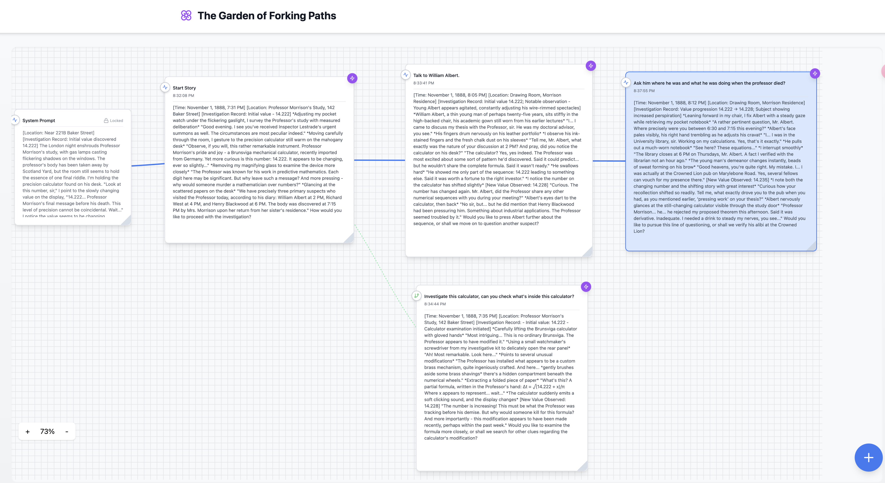

# Forking Paths : LLM Dialogue Timeline Visualizer

A React-based application for visualizing and managing branching dialogue conversations with AI integration. This project allows users to create, visualize, and navigate through multiple conversation branches while maintaining a clear visual representation of the dialogue history.



## Features

- **Interactive Timeline Visualization**: Visualize conversation branches in a dynamic, draggable graph
- **Branching Conversations**: Create alternative conversation paths and explore different dialogue options
- **AI Integration**: Seamless integration with Claude 3.5 Sonnet via OpenRouter API
- **System Prompt Management**: Configure and manage system prompts for AI interactions
- **Timeline Navigation**: Easily navigate between different conversation branches
- **Branch Merging**: Merge multiple conversation branches into a single timeline
- **Visual Controls**: 
  - Zoom in/out functionality
  - Drag and drop nodes
  - Pan canvas
  - Resize nodes
  - Grid background

## Prerequisites

- Node.js (v14 or higher)
- npm or yarn
- OpenRouter API key

## Environment Variables

Create a `.env` file in the root directory with the following variables:

```env
VITE_OPENROUTER_API_KEY=your_api_key_here
VITE_SITE_URL=your_site_url
VITE_SITE_NAME=your_site_name
``` 